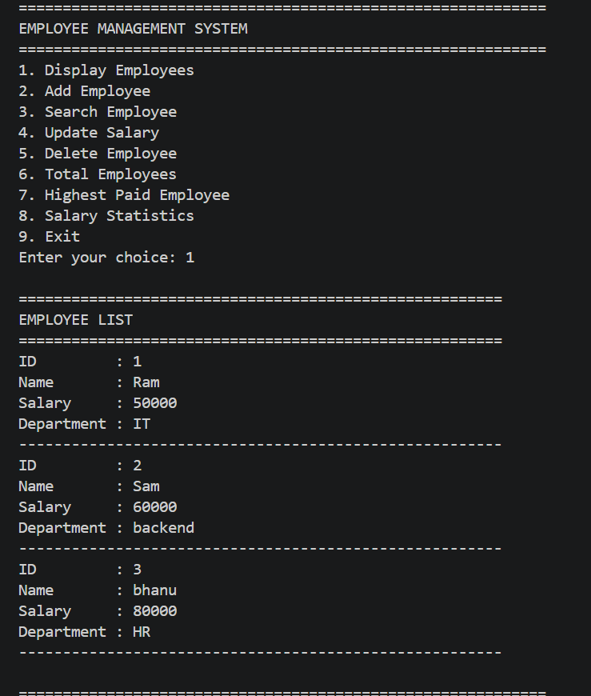

# Employee Management System

A menu-driven Employee Management System built using **Python** and **JSON** for data storage. This project demonstrates CRUD (Create, Read, Update, Delete) operations along with file handling and structured programming.

## 📸 Preview



---

## 🚀 Features

- 📋 Display all employees
- ➕ Add a new employee
- 🔍 Search employee by ID
- 💰 Update employee salary
- ❌ Delete employee
- 👥 Show total number of employees
- 🏆 Show highest paid employee
- 📊 Display salary statistics
- ✅ Duplicate employee ID validation
- 💾 Persistent data storage using JSON
- ⏳ Loading animations for a better user experience

---

## 🛠️ Technologies Used

- Python
- JSON
- File Handling
- Functions
- Lists & Dictionaries
- Loops & Conditions

---

## 📂 Project Structure

```
Employee Management System/
│
├── main.py
├── employee.json
└── README.md
```

---

## ▶️ How to Run

1. Clone the repository.

```bash
git clone https://github.com/bhanuu-u/mini-projects.git
```

2. Navigate to the project folder.

```bash
cd mini-projects/python/Employee\ Management\ System
```

3. Run the program.

```bash
python main.py
```

---

## 📸 Menu

```
============================================================
        EMPLOYEE MANAGEMENT SYSTEM
============================================================

1. Display Employees
2. Add Employee
3. Search Employee
4. Update Salary
5. Delete Employee
6. Total Employees
7. Highest Paid Employee
8. Salary Statistics
9. Exit
```

---

## 📚 Concepts Practiced

- JSON (`json.load()` & `json.dump()`)
- CRUD Operations
- File Handling
- Functions
- Lists
- Dictionaries
- Loops
- Conditional Statements
- Menu-Driven Programs

---

## 🎯 Learning Outcome

This project helped strengthen my understanding of Python file handling, JSON data storage, CRUD operations, and writing structured, modular programs.

---

## 👨‍💻 Author

**Revanth Bhanu**
