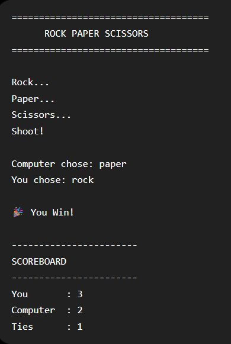

# Rock Paper Scissors

A console-based Rock Paper Scissors game built with Python.

## 📸 Preview



## Features

- Play until you type `exit`
- Score tracking
- Countdown animation
- Input validation
- Final winner announcement

## Technologies

- Python 3

## Run

```bash
python main.py
```

## Sample Output

```
Rock...
Paper...
Scissors...
Shoot!

Computer chose: paper
You chose: rock

Computer Wins!

Score
You : 3
Computer : 2
```
